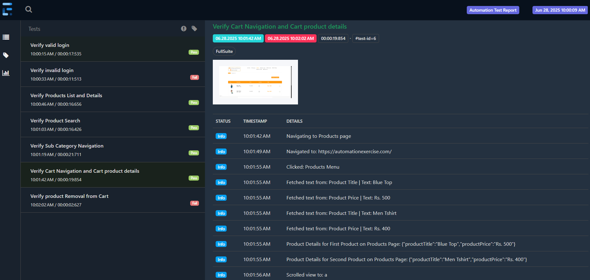

# 🧪 Selenium Test Automation Framework

[](https://github.com/yourusername/your-repo)
[](LICENSE)
[](https://testng.org/)

A **robust automation testing framework** built with **Java, Selenium WebDriver, TestNG, ExtentReports, and Maven**, using the **Page Object Model (POM)** design pattern.  
This framework is designed for clean structure, reusable utilities, beautiful HTML reports with screenshots, and easy maintenance.

---

## 📑 Table of Contents

- [Features](#features)
- [Demo](#demo)
- [Project Structure](#project-structure)
- [Installation](#installation)
- [How to Run](#how-to-run)
- [Reports](#reports)
- [Tech Stack](#tech-stack)
- [Future Enhancements](#future-enhancements)
- [License](#license)
- [Author](#author)

---

## ✨ Features

✅ Thread-safe WebDriver management  
✅ Page Object Model (POM) for clean code structure  
✅ Selenium utility class for click, sendKeys, wait, hover, scroll  
✅ Advanced ExtentReports with blocks, step logs & screenshots  
✅ Screenshot on each step and failure  
✅ TestNG suite configuration for sequential or parallel runs  
✅ Maven for build & dependency management

---

## 🖼️ Sample Report

Here is how your **Extent Report will look:**

> 📸 **Add your report screenshot as `assets/sample-report.png`**

<p align="center">
  
</p>

---

## 📁 Project Structure

```
SelAE/
 ├── src/
 │   ├── main/java/pages/         → Page Objects (ProductsPage, CartPage, etc.)
 │   ├── main/java/utils/         → Utilities (DriverFactory, SeleniumUtils, ExtentManager, ScreenshotUtil)
 │   ├── test/java/tests/         → TestNG test classes (CartTest, LoginTest, etc.)
 │   ├── test/java/listeners/     → ExtentTestNGListener
 ├── pom.xml                      → Maven dependencies
 ├── testng.xml                   → TestNG suite configuration
 ├── README.md                    → Project documentation
 ├── assets/demo.gif              → Demo GIF
 ├── test-output/                 → Extent HTML reports
```

---

## ⚙️ Installation

**1️⃣ Clone the repository**

```bash
git clone https://github.com/yourusername/your-repo.git
```

**2️⃣ Navigate into the project directory**

```bash
cd your-repo
```

**3️⃣ Install dependencies**

```bash
mvn clean install
```

---

## 🚀 How to Run

**Run all tests using Maven:**

```bash
mvn test
```

**Or run specific tests from `testng.xml` in your IDE:**

- Right-click `testng.xml` → Run as TestNG Suite

---

## 📊 Reports

After execution, a rich HTML report is generated here:

```
test-output/ExtentReport.html
```

**Report Highlights:**

✅ Test titles and sections  
✅ Collapsible blocks for each step  
✅ Screenshots for each step and failure  
✅ Detailed pass/fail logs  
✅ Execution time and environment details

---

## 🧰 Tech Stack

| Tool | Purpose |
| ---- | ------- |
| **Java** | Programming language |
| **Selenium WebDriver** | Browser automation |
| **TestNG** | Test orchestration |
| **ExtentReports (Spark Reporter)** | Beautiful HTML reporting |
| **WebDriverManager** | Automatic browser driver management |
| **Maven** | Build & dependency management |

---

## 🚦 Future Enhancements

- [ ] Add multi-browser & cross-platform support
- [ ] Enable parallel execution
- [ ] Integrate with CI/CD (GitHub Actions, Jenkins)
- [ ] Add Retry Analyzer for flaky tests
- [ ] Add Docker & Selenium Grid support

---

## 📜 License

This project is licensed under the [MIT License](LICENSE).

---

## 🙌 Author

**Nirusha Manandhar**

---

✅ **Copy this whole block → save as `README.md` → done.**

Happy Testing! 🚀✨
